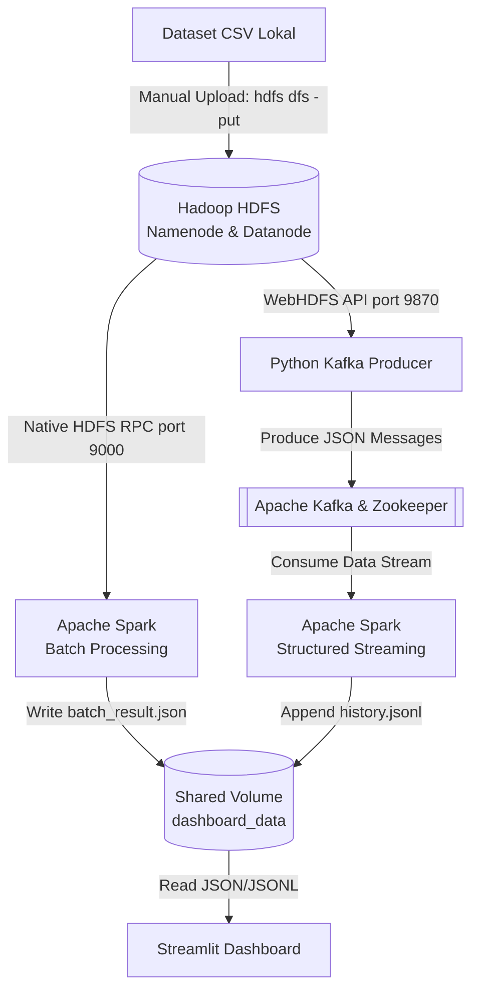

# **US Stock Market Big Data Pipeline**

**Course:** Big Data Processing  
**Level:** Undergraduate (3rd Year)

---

# **1. Architecture Diagram**

Sistem ini dirancang menggunakan arsitektur pemrosesan data terdistribusi (*Distributed Data Processing Architecture*) yang mengintegrasikan penyimpanan terdistribusi, perantara pesan (*message broker*), komputasi batch, komputasi aliran (*stream*), dan visualisasi data waktu nyata.



## **Detail Komponen Arsitektur**

### **1. Hadoop Distributed File System (HDFS)**

Bertindak sebagai Data Lake utama. Menyimpan data mentah historis dengan toleransi kesalahan tinggi menggunakan namenode dan datanode.

### **2. Python Producer**

Mengunduh data secara langsung dari HDFS melalui WebHDFS API, memprosesnya, dan mensimulasikan aliran data perdagangan harian yang dikirim ke Kafka.

### **3. Apache Kafka & Zookeeper**

Bertindak sebagai sistem perantara pesan terdistribusi. Menerima aliran data dari Producer pada topik `stock-market-stream` dan menyalurkannya ke sistem komputasi hilir.

### **4. Apache Spark (Cluster Mode)**

#### **Batch Processing**

Membaca dataset masif langsung dari HDFS untuk menghitung wawasan historis jangka panjang.

#### **Structured Streaming**

Berlangganan ke topik Kafka untuk memproses data secara waktu nyata (*real-time*) menggunakan arsitektur Master-Worker, kemudian menyimpan agregasi mikro-batch ke penyimpanan bersama.

### **5. Streamlit**

Aplikasi web interaktif yang menyajikan data hasil pemrosesan Batch dan Streaming ke dalam antarmuka visual yang profesional tanpa menyegarkan ulang seluruh halaman (*anti-glitch fragment*).

---

# **2. Project Description**

Proyek ini adalah implementasi End-to-End Big Data Pipeline yang dirancang untuk mensimulasikan, memproses, dan memvisualisasikan data perdagangan pasar saham Amerika Serikat (US Stock Market). Sistem ini dibangun dari nol menggunakan infrastruktur Docker Compose yang terisolasi.

Tujuan utama dari sistem ini adalah membuktikan kapasitas teknologi pemrosesan data besar dalam menangani dua paradigma utama secara bersamaan:

### **1. Pengolahan Historis (Batch)**

Menganalisis puluhan ribu hingga jutaan baris data masa lalu untuk mencari tren fundamental pasar.

### **2. Pengolahan Waktu Nyata (Stream)**

Menangkap volatilitas pasar per detik dan menyajikannya secara langsung ke hadapan pengguna akhir melalui antarmuka grafis tingkat lanjut.

---

# **3. Problem Statement**

Pasar saham menghasilkan volume data yang sangat masif setiap harinya. Investor dan analis membutuhkan sistem yang tidak hanya mampu melihat rekam jejak masa lalu, tetapi juga memantau kondisi pasar saat ini tanpa latensi tinggi.

Proyek ini dirancang untuk menjawab pertanyaan bisnis berikut melalui dua pendekatan:

## **Batch Insights (Analisis Jangka Panjang)**

- Sektor industri mana yang memiliki tingkat risiko atau volatilitas tertinggi sepanjang masa?
- Perusahaan apa saja yang mencatatkan keuntungan rata-rata harian (*Daily Gain*) tertinggi secara historis?
- Bagaimana tren pertumbuhan harga saham per sektor dari tahun ke tahun?

## **Real-Time Metrics (Analisis Waktu Nyata)**

- Berapa total sirkulasi volume transaksi pasar yang sedang terjadi pada hari ini?
- Bagaimana perbandingan sentimen pasar secara keseluruhan (jumlah saham yang harganya naik dibandingkan yang turun)?
- Siapa entitas perusahaan yang menjadi penyumbang keuntungan harian (*Top Gainer*) tertinggi pada momen perdagangan saat ini?

---

# **4. Dataset**

Proyek ini menggunakan dataset historis pasar saham Amerika Serikat yang tersedia secara publik.

| Keterangan | Detail |
|------------|---------|
| Domain | Pasar Keuangan dan Saham (Finance / Stock Market) |
| Sumber | Kaggle (US Stock Market Historical OHLCV) |
| Ukuran File | ~33 MB |
| Karakteristik Data | Memuat data harian untuk berbagai perusahaan yang mencakup harga pembukaan, penutupan, tertinggi, terendah, dan volume transaksi |
| Field Kunci | Date, Open, High, Low, Close, Volume, Sector, Ticker, Company_Name |

## **Instruksi Pengunduhan Dataset**

1. Kunjungi dataset Kaggle: [US Stock Market Historical OHLCV Dataset](https://www.kaggle.com/datasets/asadullahcreative/us-stock-market-historical-ohlcv-dataset)
2. Unduh (*download*) dan ekstrak dataset tersebut.
3. Ubah nama file utama menjadi:

```text
stock_prices_daily.csv
```

4. Pindahkan file tersebut ke dalam folder:

```text
data/
```

pada direktori proyek.

# **5. How to Run**

Ikuti instruksi langkah demi langkah di bawah ini untuk menjalankan seluruh pipeline dari awal hingga akhir pada lingkungan lokal Anda.

> **Pastikan Docker Desktop telah berjalan.**

---

## **Langkah 1: Kloning Repositori**

Buka terminal dan jalankan perintah berikut:

```bash
git clone https://github.com/bernardbearrrrr/big-data-pipeline-us-stock.git

cd big-data-pipeline-us-stock
```

---

## **Langkah 2: Persiapan Infrastruktur Container**

Jalankan Docker Compose untuk membangun dan menghidupkan seluruh layanan klaster (HDFS, Kafka, Spark, Producer, Dashboard).

```bash
docker compose up --build -d
```

*Tunggu sekitar 1–2 menit hingga Namenode HDFS dan Kafka Broker benar-benar dalam status siap (healthy).*

---

## **Langkah 3: Injeksi Data ke HDFS (Data Engineering)**

Dataset lokal tidak dapat dibaca secara langsung. Anda harus membuat direktori di dalam Hadoop dan mengunggah CSV ke dalam sistem HDFS.

```bash
docker exec -it bdp-namenode hdfs dfs -mkdir -p /data

docker exec -it bdp-namenode hdfs dfs -put /tmp/local_data/stock_prices_daily.csv /data/
```

---

## **Langkah 4: Menjalankan Spark Batch Analysis**

Eksekusi pekerjaan Batch untuk menganalisis seluruh sejarah data yang ada di dalam HDFS.

```bash
docker exec -it bdp-spark-master \
/opt/spark/bin/spark-submit \
/opt/project/jobs/batch_analysis.py
```

---

## **Langkah 5: Menjalankan Spark Structured Streaming**

Hidupkan pekerjaan Streaming yang akan mendengarkan aliran pesan dari Kafka secara terus-menerus.

```bash
docker exec -it bdp-spark-master \
/opt/spark/bin/spark-submit \
--master spark://spark-master:7077 \
--packages org.apache.spark:spark-sql-kafka-0-10_2.13:4.0.0 \
/opt/project/jobs/streaming_job.py
```

---

## **Langkah 6: Memulai Kafka Producer**

Buka tab terminal baru. Jalankan skrip Producer untuk memulai simulasi pengiriman data pasar harian dari HDFS ke Kafka.

```bash
docker exec -it bdp-producer python producer/producer.py
```

---

## **Langkah 7: Akses Dashboard Streamlit**

Buka browser web Anda dan navigasikan ke alamat berikut:

```text
http://localhost:8501
```

---

# **6. Expected Output**

Jika seluruh perintah di atas dijalankan dengan benar, berikut adalah hasil yang akan Anda lihat.

## **Keluaran Konsol (Terminal)**

### **Producer**

Menampilkan log seperti:

```text
[INFO] Mendownload dan membaca /data/stock_prices_daily.csv dari HDFS...
```

Diikuti oleh:

```text
[MARKET OPEN]
```

dan

```text
[MARKET CLOSED]
```

setiap 3 detik.

### **Spark Batch**

Mencetak tahapan pemrosesan logika (Volatilitas, Top Gainers) dan diakhiri dengan:

```text
✅ BATCH SELESAI!
```

Hasil analisis disimpan pada:

```text
/opt/project/dashboard_data/batch_result.json
```

---

## **Keluaran Dashboard (Browser UI)**

### **Tab Live TradingView**

- Grafik Candlestick dinamis
- Update otomatis tanpa refresh halaman
- Watchlist pada panel kanan

### **Tab Market Overview**

- Kartu metrik "Live Market Pulse"
- Price Heatmap berbasis Treemap
- Pengelompokan saham berdasarkan volume dan perubahan persentase harian

### **Tab Batch Analytics**

Menampilkan empat grafik analisis mendalam dari data historis:

- Risiko sektor
- Pangsa volume
- Tren harga tahunan
- Pencetak keuntungan tertinggi

---

# **7. Findings & Conclusion**

Berdasarkan hasil analisis dari pipeline Big Data ini, kami menemukan beberapa wawasan utama.

## **1. Analisis Historis (Batch)**

Melalui pemrosesan HDFS oleh Spark, terlihat jelas bahwa sektor Teknologi memiliki volatilitas (rentang antara harga tertinggi dan terendah) dan dominasi volume yang jauh lebih masif dibandingkan sektor lain. Tren ini menunjukkan tingkat spekulasi dan likuiditas yang tinggi pada sektor tersebut secara historis.

## **2. Pemantauan Waktu Nyata (Stream)**

Pada pemantauan simulasi aliran data langsung, rasio sentimen pasar (*Market Sentiment*) berubah secara dinamis setiap harinya. Melalui integrasi Kafka dan Spark Streaming, sistem berhasil menangkap anomali perubahan volume mendadak (*spike*) yang langsung diproyeksikan pada fitur Treemap Heatmap, membuktikan bahwa arsitektur ini sanggup memberikan informasi kritis seketika (*low latency*) bagi analis bisnis.

Secara keseluruhan, arsitektur ini membuktikan kemampuannya dalam melakukan dekopling (pemisahan tugas) antara penyimpanan mentah, perantara pesan, dan pemrosesan komputasi berat dengan sangat andal.

---

# **8. Known Limitations**

Meskipun sistem beroperasi dengan baik, terdapat beberapa batasan yang diketahui pada arsitektur pengujian lokal ini.

## **Kapasitas Skalabilitas Perangkat Keras**

Karena sistem berjalan di dalam wadah Docker lokal (*localhost*), komputasi Spark Terdistribusi dibatasi oleh alokasi memori komputer fisik pengembang. Skala data hingga ukuran Terabyte dapat menyebabkan kebuntuan memori (*Out Of Memory*).

## **Proses Ingesti Manual**

File CSV awal masih harus diunggah secara manual ke dalam HDFS menggunakan perintah:

```bash
hdfs dfs -put
```

Dalam skenario produksi di dunia nyata, komponen tambahan seperti Apache NiFi, Airflow, atau skrip pengunduhan harian terjadwal (Cron/Celery) diperlukan untuk mengotomatiskan injeksi data langsung dari API sumber ke dalam sistem Hadoop.